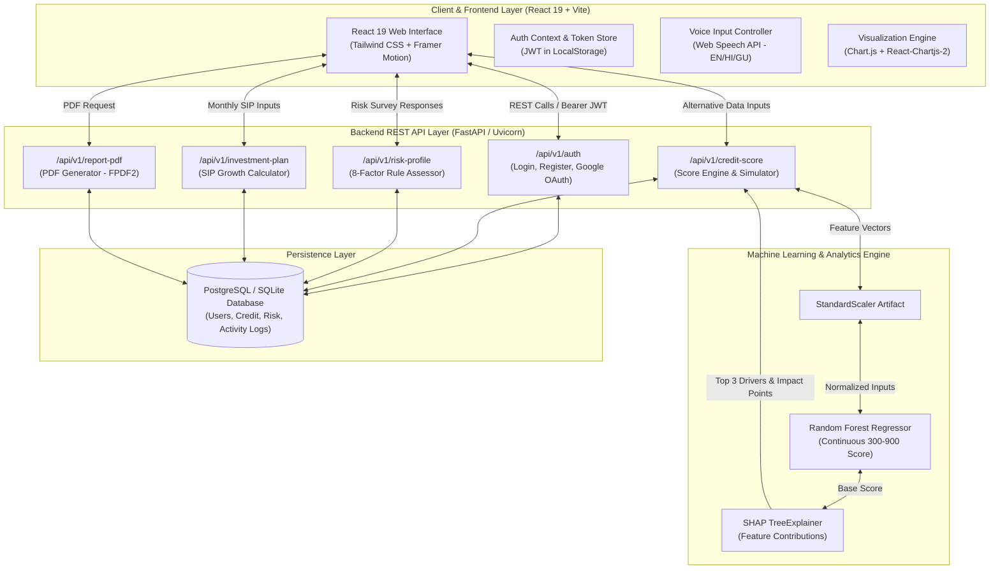
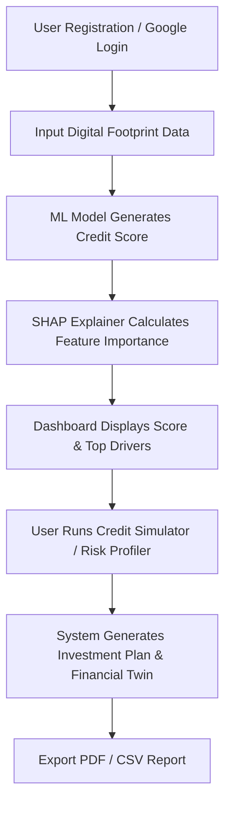
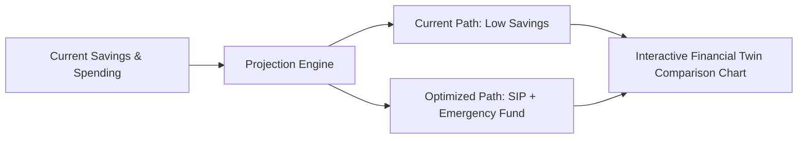
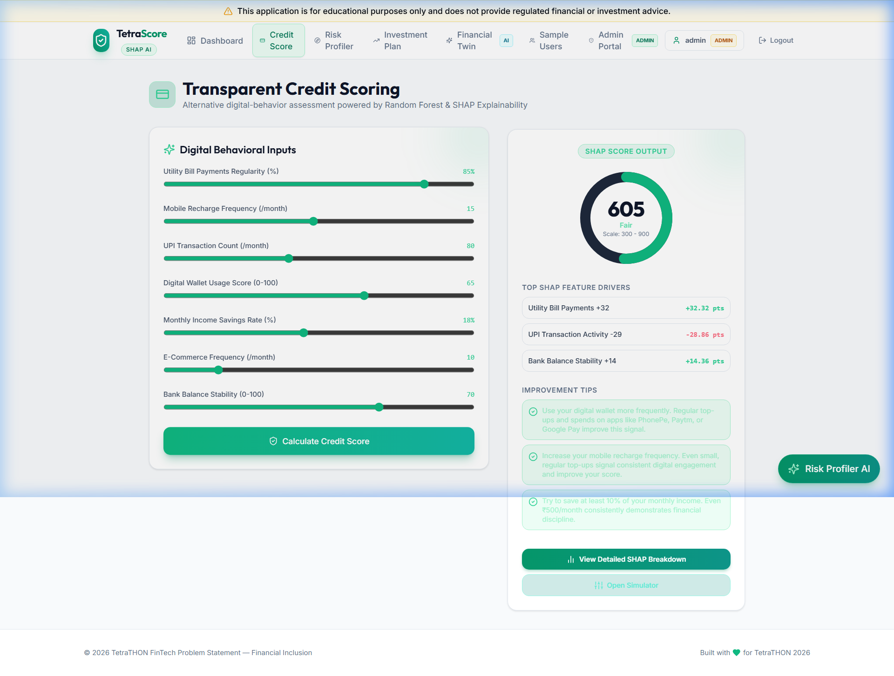
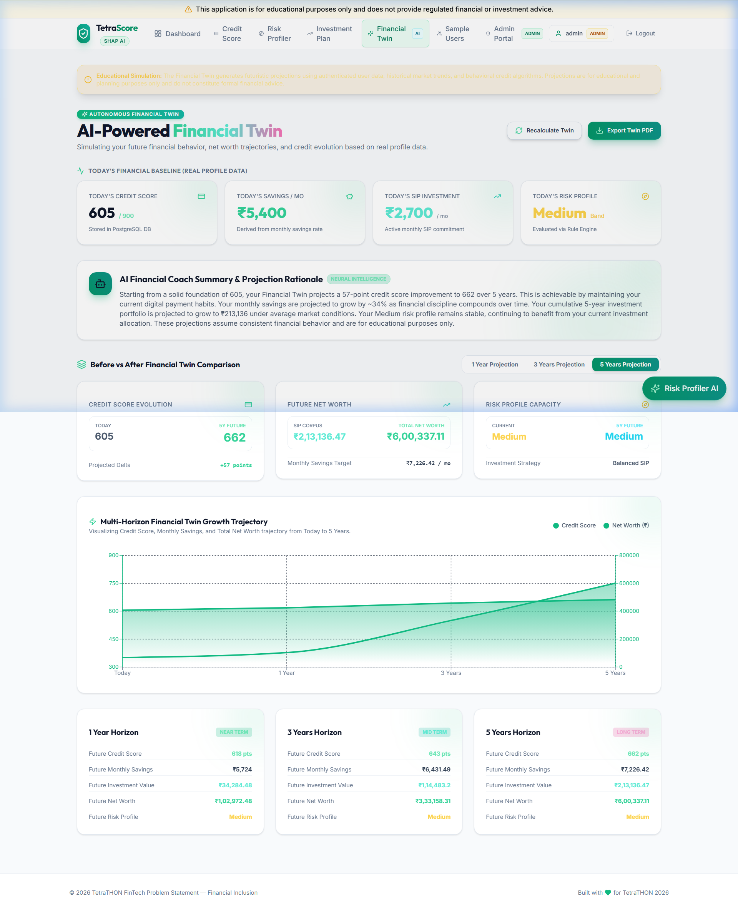
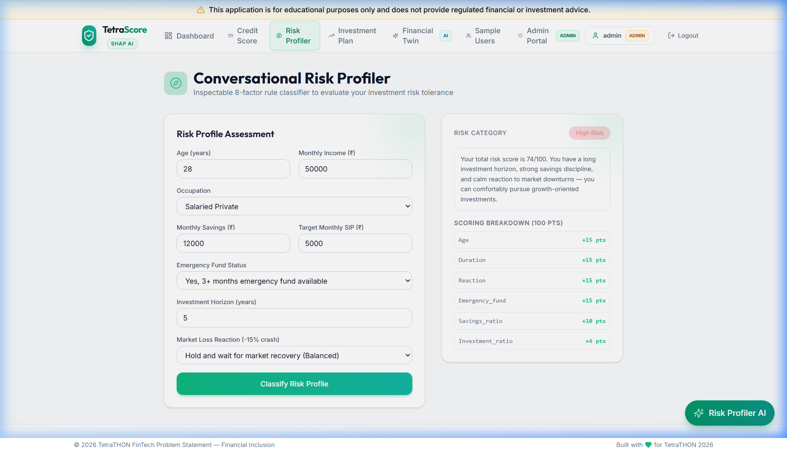
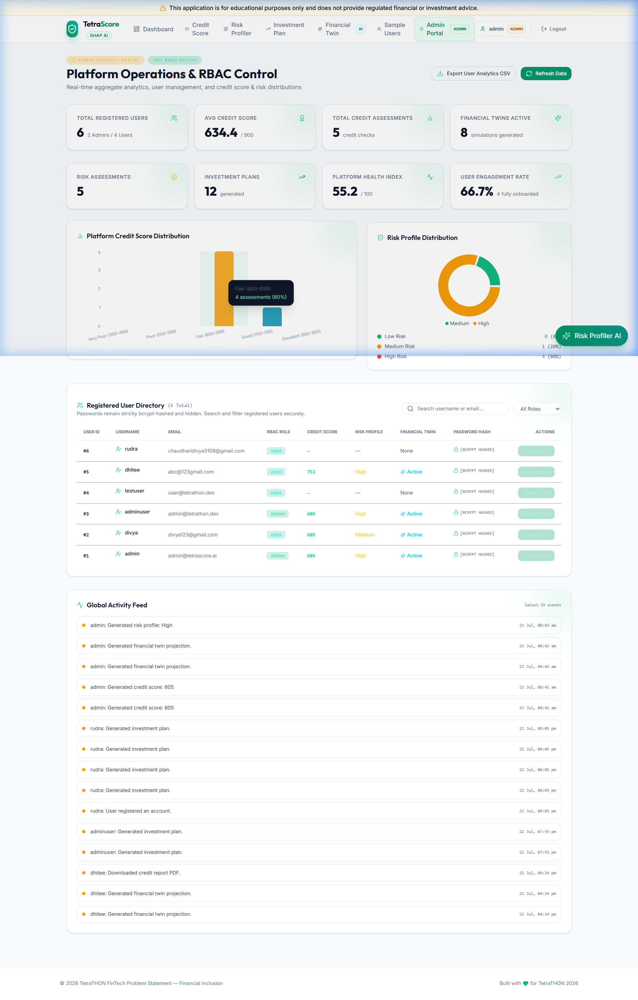

# TetraScore

Transparent Credit Scoring & AI-Driven Micro-Investment Advisor for Underserved Users

TetraScore is a web platform built to evaluate creditworthiness for credit-invisible individuals using alternative digital footprint data and provide transparent, explainable financial advisory tools.

---

## Project Overview

Many individuals in emerging markets lack a traditional credit score due to the absence of credit card or formal loan history. This leaves them excluded from formal financial services. TetraScore addresses this gap by using alternative digital signals—such as utility bill payments, mobile recharge history, and digital transaction patterns—to generate an explainable credit score.

Alongside scoring, the platform includes a risk-profiling workflow, an AI micro-investment advisor, and a Financial Twin module that projects future financial health based on current user habits.

---

## Problem Statement

1. **Credit Invisibility:** Millions of individuals cannot access affordable credit because traditional scoring systems rely strictly on past borrowing history.
2. **Opaque Decisions:** Existing automated credit models operate as black boxes, giving applicants no context when denied or scored poorly.
3. **Guidance Gap:** First-time earners and underserved users often lack access to tailored financial planning and beginner-friendly micro-investment advice.

---

## Our Solution

TetraScore provides a unified platform that solves both credit access and financial guidance:

- **Alternative Data Credit Scoring:** Evaluates non-traditional metrics like payment regularity and transaction stability to score credit-invisible users on a standard 300–900 scale.
- **SHAP Feature Importance:** Breaks down each score into exact positive and negative feature contributions, showing users why their score is what it is.
- **Interactive Action Plan:** Gives practical suggestions and real-time score simulation when financial behaviors improve.
- **Micro-Investment Advisory:** Matches users to beginner-friendly asset allocations based on a conversational risk tolerance profiler.
- **Financial Twin Simulation:** Projects long-term financial trajectories under different savings and investment scenarios.

---

## Key Features

- **Explainable Credit Scoring:** Generates credit scores using alternative digital behavior inputs.
- **SHAP Feature Importance:** Visual breakdown of top drivers influencing score calculation.
- **Credit Improvement Simulator:** Interactive sliders allowing users to simulate how habits impact their score in real time.
- **Conversational Risk Profiling:** 8-factor rule-based assessment evaluating financial capacity and risk tolerance.
- **Micro-Investment Recommendations:** Automated portfolio allocation (Equities, Debt, Liquid funds) matched to risk tier.
- **Growth Projection Charts:** 1-year, 3-year, and 5-year compounding SIP growth simulations.
- **Financial Twin:** Visual projections comparing current trajectory against disciplined financial habits.
- **PDF & CSV Export:** Downloadable official reports and raw assessment logs.
- **User & Admin Dashboards:** Dedicated views for personal metrics and platform-wide administrative management.
- **Role-Based Authentication:** JWT authentication with optional Google OAuth2 single sign-on.

---

## System Architecture



---

## Technology Stack

### Frontend
- **Framework:** React 19, TypeScript, Vite
- **Styling:** Tailwind CSS
- **Charts & Data Visualization:** Chart.js, React-Chartjs-2
- **Icons & UI:** Lucide React, Framer Motion

### Backend
- **Framework:** FastAPI (Python)
- **ORM & Database Management:** SQLAlchemy, Alembic
- **HTTP Client:** HTTPX

### Database & Security
- **Database:** PostgreSQL (SQLite supported for local development)
- **Authentication:** JWT (JSON Web Tokens), Google OAuth 2.0
- **Password Hashing:** bcrypt

### Machine Learning
- **Model:** Scikit-learn (Random Forest Regressor)
- **Explainability:** SHAP (TreeExplainer)
- **Report Generation:** FPDF2

---

## Project Workflow



---

## Explainable AI Pipeline

1. **Input Processing:** Raw digital behavior signals (utility payment regularity, mobile recharges, UPI volume, wallet usage, bank balance stability) are normalized and passed to the model.
2. **Inference:** A pre-trained `RandomForestRegressor` estimates the continuous credit score between 300 and 900.
3. **Explanations:** The `shap.TreeExplainer` computes exact Shapley values for each feature relative to the baseline score.
4. **Interpretation:** The backend converts Shapley values into positive/negative score impact points and surfaces the top 3 contributing factors along with practical advice.

---

## Financial Twin Workflow



The Financial Twin compares two parallel futures:
- **Baseline Trajectory:** Projected net worth if current spending and savings habits remain unchanged.
- **Optimized Trajectory:** Projected net worth if suggested micro-investments and credit improvement actions are implemented.

---

## Database Design

The schema consists of five core tables:

- `users`: Stores user identity, hashed passwords, auth provider, role (`USER` / `ADMIN`), and language preference.
- `credit_assessments`: Records input behavior signals, calculated credit score, SHAP top drivers, and recommended suggestions.
- `risk_assessments`: Holds raw risk survey answers, overall risk level (`Low`, `Medium`, `High`), and scoring breakdown.
- `investment_plans`: Stores SIP amounts, risk tolerance tier, asset allocations, and projected returns.
- `login_history` & `activity_logs`: Audit trail for account security and platform events.

---

## Security Features

- **Password Safety:** All local passwords are hashed using bcrypt with custom salt rounds; plain-text passwords are never logged or stored.
- **Stateless Authentication:** Secure JWT access tokens with configurable expiration times.
- **Role-Based Access Control (RBAC):** Distinct permission scopes for standard users vs. system administrators.
- **Admin Bootstrapping:** Protected endpoint requiring a server-side seed secret (`ADMIN_SEED_SECRET`) to provision admin users.
- **Rate Limiting:** In-memory request rate limiting on authentication routes to mitigate brute-force attempts.

---

## Folder Structure

```text
tetrathon-2026/
├── backend/
│   ├── app/
│   │   ├── api/v1/          # Route handlers (auth, credit, admin)
│   │   ├── core/            # Config, database connection, security
│   │   ├── models/          # SQLAlchemy ORM models
│   │   └── schemas/         # Pydantic validation schemas
│   ├── tests/               # Backend test suite
│   ├── Dockerfile
│   └── requirements.txt
├── frontend/
│   ├── src/
│   │   ├── components/      # Reusable UI components
│   │   ├── pages/           # Application views
│   │   ├── context/         # Auth & global state context
│   │   └── api/             # API client integration
│   ├── Dockerfile
│   └── package.json
├── database/
│   └── schema.sql           # PostgreSQL database initialization
├── ml/
│   ├── models/              # Pre-trained joblib artifacts
│   ├── generate_dataset.py  # Synthetic data generation script
│   └── train_model.py       # Model training & SHAP exporter
├── docker-compose.yml
├── .env.example
└── README.md
```

---

## Installation

### Prerequisites
- Node.js (v18+)
- Python (v3.10+)
- PostgreSQL (Optional; default configuration falls back to local SQLite)

### Setup Steps

1. Clone the repository:
   ```bash
   git clone https://github.com/dtnotdt/Transparent-Credit-Scoring-AI-Driven-Micro-Investment-Advisor-for-Underserved-Users.git
   cd Transparent-Credit-Scoring-AI-Driven-Micro-Investment-Advisor-for-Underserved-Users
   ```

2. Configure environment variables:
   ```bash
   cp .env.example .env
   ```

3. Backend setup:
   ```bash
   cd backend
   py -m pip install -r requirements.txt
   ```

4. Frontend setup:
   ```bash
   cd ../frontend
   npm install --legacy-peer-deps
   ```

---

## Environment Variables

Key parameters in `.env`:

```ini
# Application
APP_NAME="TetraScore"
DEBUG=true
ENVIRONMENT=development

# Database (Use PostgreSQL in prod, SQLite in dev)
DATABASE_URL=sqlite:///./tetrathon.db

# JWT Security
SECRET_KEY=your-random-256-bit-secret-key
ALGORITHM=HS256
ACCESS_TOKEN_EXPIRE_MINUTES=60

# Frontend & CORS
FRONTEND_URL=http://localhost:5173

# Google OAuth 2.0
GOOGLE_CLIENT_ID=your-google-client-id
GOOGLE_CLIENT_SECRET=your-google-client-secret
GOOGLE_REDIRECT_URI=http://localhost:8000/api/v1/auth/google/callback

# Admin Seed
ADMIN_SEED_SECRET=your-admin-seed-secret
```

---

## Running the Project

### Option A: Local Development Server

**Terminal 1 (Backend):**
```bash
cd backend
py -m uvicorn app.main:app --port 8000 --reload
```
- API Docs: `http://localhost:8000/docs`

**Terminal 2 (Frontend):**
```bash
cd frontend
npm run dev
```
- Web Application: `http://localhost:5173`

---

### Option B: Docker Compose

```bash
docker compose up --build
```

---

## API Overview

| Method | Endpoint | Auth | Description |
|---|---|---|---|
| `POST` | `/api/v1/auth/register` | Public | Register new user account |
| `POST` | `/api/v1/auth/login` | Public | Authenticate user & return JWT token |
| `GET`  | `/api/v1/auth/google/login` | Public | Initiate Google OAuth2 flow |
| `GET`  | `/api/v1/auth/google/callback` | Public | Google OAuth2 callback redirect |
| `POST` | `/api/v1/credit-score` | Bearer JWT | Compute credit score, SHAP drivers, & recommendations |
| `POST` | `/api/v1/risk-profile` | Bearer JWT | Submit 8-factor risk questionnaire |
| `POST` | `/api/v1/investment-plan` | Bearer JWT | Generate asset allocation & SIP growth projections |
| `GET`  | `/api/v1/dashboard/{user_id}` | Bearer JWT | Retrieve aggregated user stats & audit history |
| `POST` | `/api/v1/report-pdf` | Bearer JWT | Generate and download formal PDF financial report |

---

## Screenshots

| Credit Scoring & SHAP Explanation | Financial Twin & Growth Chart |
|:---:|:---:|
|  |  |

| Risk Profiling Questionnaire | Admin Analytics Dashboard |
|:---:|:---:|
|  |  |

---

## Future Improvements

- **Open Banking API Integration:** Connect directly with Account Aggregators (AA) for automated, consent-based bank statement parsing.
- **On-Device Offline Inference:** Quantize ML models to run locally in mobile web browsers for zero-latency assessments in low-bandwidth regions.
- **Localized Regional Support:** Expand Financial Twin voice interactions to more regional Indian languages.
- **Automated Recurring Micro-Investments:** Partner with UPI micro-savings gateways to automate daily round-up investments.

---

## Team Contributions

- **Frontend & UI/UX:** Built the React + TypeScript frontend, interactive Chart.js visualizations, credit simulator UI, and responsive dashboard layouts.
- **Backend & Security:** Designed the FastAPI REST architecture, PostgreSQL schema, JWT authentication, and Google OAuth2 integration.
- **Machine Learning & Explainability:** Trained the Random Forest scoring model, implemented SHAP TreeExplainer interpretation, and built the risk profiling engine.
- **DevOps & Integration:** Configured Docker containerization, PDF generation pipeline, and project documentation.

---

## Educational Disclaimer

*This project was developed for educational and hackathon evaluation purposes only. TetraScore is not a registered financial advisor or credit bureau. Score calculations and investment recommendations should not be used as formal financial or legal advice.*
