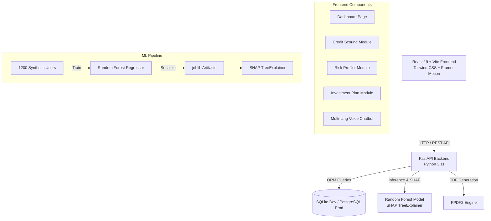
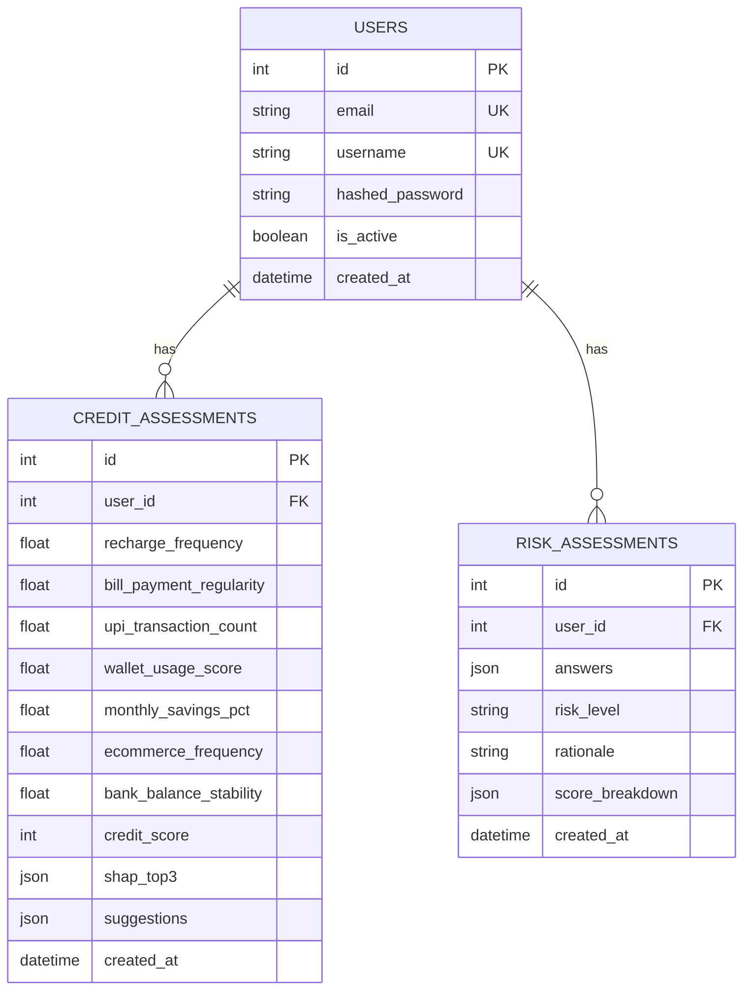
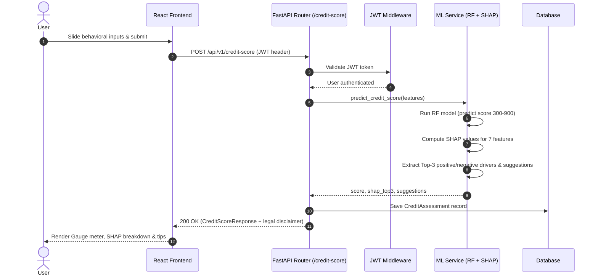
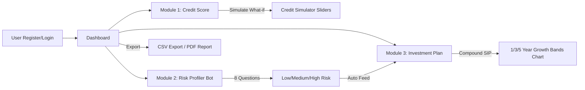
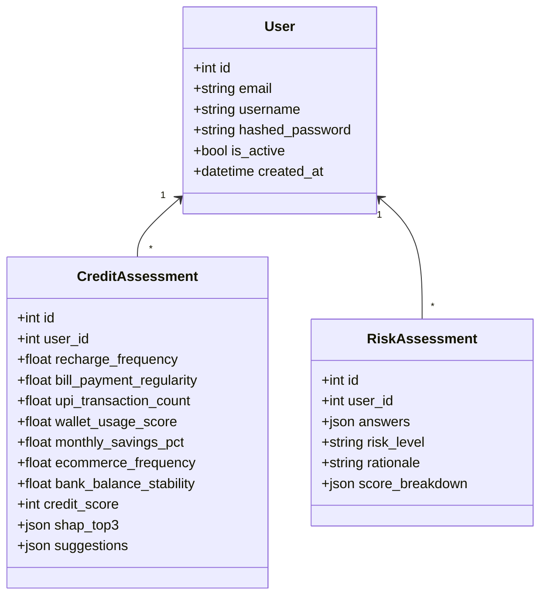

# Architecture & System Diagrams

Comprehensive technical specification for TetraTHON 2026 Transparent Credit Scoring & AI-Powered Micro Investment Advisor.

---

## 1. System Architecture Diagram

---

## 2. Entity-Relationship (ER) Diagram

---

## 3. Credit Score Request Sequence Diagram

---

## 4. Workflow Diagram

---

## 5. Backend Class Diagram

